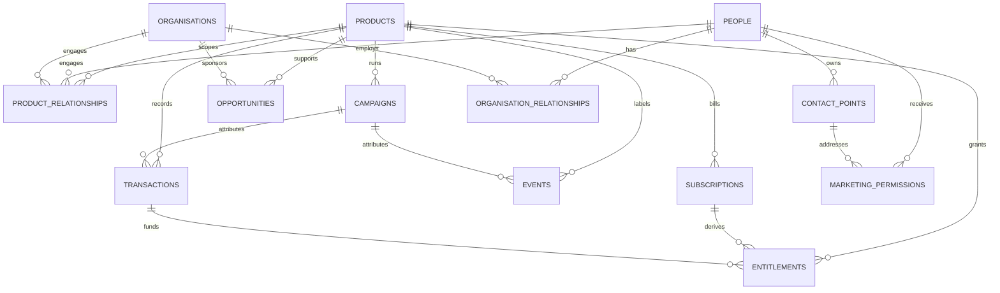

# Vamberic Studio Platform API

The initial API foundation for the Vamberic Studio platform. This service is intentionally domain-neutral: it provides the HTTP, configuration, observability, and safety foundations that future product domains can build on without connecting to a database or external provider.

## Local development

1. Copy `.env.example` to `.env` and adjust values if needed.
2. Install workspace dependencies with `pnpm install`.
3. Start the API with `pnpm --filter @workspace/api-server run dev`.

The API listens on `PORT` (5000 by default). The health endpoints are:

- `GET /health`
- `GET /api/v1/health`
- `GET /ready`
- `GET /api/v1/ready`

The existing `/api/healthz` path remains available for the local service startup probe.
Health is a liveness check and does not depend on MongoDB. Readiness returns HTTP
200 only when the API can ping MongoDB, and otherwise returns HTTP 503 without
exposing connection details.

## Environment variables

| Variable                  | Required | Default                        | Description                                               |
| ------------------------- | -------- | ------------------------------ | --------------------------------------------------------- |
| `NODE_ENV`                | No       | `development`                  | `development`, `test`, or `production`                    |
| `DEPLOYMENT_ENV`          | Yes      | —                              | Deployment environment: `dev`, `prod`, `test`, or `local` |
| `MONGODB_URI`             | Yes      | —                              | MongoDB Atlas or local MongoDB connection URI             |
| `PORT`                    | No       | `5000`                         | HTTP port                                                 |
| `SERVICE_NAME`            | No       | `vamberic-studio-platform-api` | Service identifier returned by health                     |
| `API_VERSION`             | No       | `0.1.0`                        | API version returned by health                            |
| `LOG_LEVEL`               | No       | `info`                         | Pino log level                                            |
| `CORS_ORIGINS`            | No       | `http://localhost:3000`        | Comma-separated explicit allowed origins                  |
| `RATE_LIMIT_WINDOW_MS`    | No       | `60000`                        | Rate-limit window                                         |
| `RATE_LIMIT_MAX_REQUESTS` | No       | `100`                          | Requests per IP and window                                |

Invalid configuration causes startup to fail with a clear validation error.
Cognito configuration is required in all environments; there is no authentication
bypass. See [authentication setup](../../docs/vapp-authentication.md) for the
required `AWS_REGION`, `COGNITO_USER_POOL_ID`, and `COGNITO_CLIENT_ID`, route
protection, and local test-key verification.

## Structure

```text
src/
├── app.ts                 # Express composition root
├── config.ts              # Zod-validated environment configuration
├── index.ts               # HTTP server lifecycle and graceful shutdown
├── lib/
│   └── logger.ts          # Structured Pino logger
├── middlewares/
│   ├── errors.ts          # 404 and centralized error handling
│   ├── rate-limit.ts      # Configurable in-process rate limiting
│   └── request-id.ts      # Correlation ID support
└── routes/
    ├── health.ts          # Versioned and unversioned health endpoints
    ├── readiness.ts       # MongoDB-backed readiness endpoints
    └── index.ts           # Route composition
services/
└── mongo.ts               # Reusable lazy MongoDB client and ping
```

Future domain modules should be added as isolated route/service/provider boundaries for identity, organisations, CRM, products, entitlements, assessments, events, communications, payments, GDPR/retention, and agents. External providers should be introduced behind interfaces rather than imported directly into domain logic.

## Vapp v1 data model

The Platform API owns the MongoDB connection. Vapp and product applications use
the API and never connect to MongoDB directly. The v1 domain model has one
canonical `people` record per human, while email/phone values live in
`contact_points`; a changed or invalid contact point therefore never erases a
person or their history. Employment is historical in
`organisation_relationships`, and CRM lifecycle is intentionally separate from
the historical `marketing_permissions` ledger.

The fourteen domain collections are:

| Collection                   | Responsibility                                                   |
| ---------------------------- | ---------------------------------------------------------------- |
| `products`                   | Vamberic products, lifecycle, commercial model and archive state |
| `people`                     | Canonical human records                                          |
| `contact_points`             | Email, phone and future contact channels                         |
| `organisations`              | Companies, prospects, customers and partners                     |
| `organisation_relationships` | Current and historical employment/association                    |
| `product_relationships`      | Person/organisation relationship per product                     |
| `marketing_permissions`      | Permission and lawful-basis history                              |
| `opportunities`              | Configurable, lightweight B2B pipeline                           |
| `subscriptions`              | Provider-neutral recurring billing records                       |
| `entitlements`               | Durable access, including one-off purchases                      |
| `campaigns`                  | Acquisition/outbound/content campaign definitions                |
| `imports`                    | Auditable import runs and field policy metadata                  |
| `events`                     | Bounded, append-oriented activity envelope                       |
| `transactions`               | Provider-neutral financial events                                |



Every domain document has an immutable application `id`, UTC `createdAt` and
`updatedAt`, `schemaVersion`, actor audit metadata, and archive/source metadata
where appropriate. The Platform API generates IDs centrally as
`<collection-prefix>_<lowercase Crockford ULID>`; Mongo `_id` remains internal.
References are IDs rather than large embedded person or organisation objects.
Events use a common envelope; their `payload` is restricted to 50 keys and 16KB
so event-specific metadata cannot become an unbounded unsafe object.

Financial values use integer minor units (`grossAmountMinor`,
`recurringAmountMinor`, `estimatedValueMinor`, `spendMinor`, and transaction
tax/fee/net fields) alongside runtime-supported three-letter ISO 4217 currency
codes. Amounts are non-negative safe integers. Optional opportunity and campaign
amounts must be paired with their currency. Refund and adjustment direction is
represented by `type`, never a negative amount, and `originalTransactionId`
links a refund or adjustment to its source transaction.
Subscriptions, entitlements, and transactions identify customers with
`personId` and/or `organisationId`; generic `customerReference` is not part of
the model. Marketing permissions are historical decisions with `effectiveAt`;
`resolveEffectiveMarketingPermission` deterministically resolves the latest
applicable decision. Events and permission decisions have no update contract,
while transaction updates are status-only. Same-state transaction updates are
idempotent. The allowed lifecycle is pending → completed/failed/voided,
completed → refunded, plus same-state writes; terminal states cannot reopen.

Contact points retain their original value in `value`; the central normalizer
trims/lowercases email and removes phone formatting without inventing a country
code. Normalized values are not globally unique. A partial unique index prevents
more than one primary contact of a given type for one person.

### Database setup and indexes

Run `pnpm --filter @workspace/api-server run db:setup -- --dry-run` in an
environment with the intended `MONGODB_URI` configured for a live, read-only
preflight. It creates no collections, indexes, or schema metadata and reports
counts, missing resources, incompatible indexes, and possible unique-index
risks. The report includes existing schema version and a compatibility
classification, and uses read-only duplicate aggregation for populated missing
unique indexes where available. The command requires an explicit mode:
`--dry-run` is read-only and `--apply` is the only mutating mode. Running
without a mode refuses to connect.

Run `pnpm --filter @workspace/api-server run db:setup -- --apply` to create missing collections,
`schema_versions`, and the indexes declared in `src/db/collections.ts`. It
records schema version `1` and migration `001-vapp-v1-baseline` on first setup
and is safe to run repeatedly. It backfills that ledger entry on a compatible
existing same-version metadata document without changing an existing entry. It
never drops collections, deletes data, or silently changes an existing index.
If an existing index has the same name but incompatible keys or options, setup
fails and a reviewed migration is required. The command intentionally emits
only a generic failure message so connection credentials cannot leak into logs.

The indexes focus on application ID/slug uniqueness, normalized contact lookup,
primary-contact exclusivity, product/person/organisation relationship queries,
provider external IDs, and time-oriented event/transaction access. Premature
standalone low-cardinality status indexes are intentionally omitted. The
complete rationale is kept beside each index definition rather than adding
speculative indexes.

Persistence code can use `getDomainCollections(db)` from
`src/db/collections.ts`. Its `DomainCollections` return type maps each of the
fourteen names to the corresponding domain persistence type, so a repository
cannot accidentally use (for example) an events collection as a people
collection.

## Checks

```sh
pnpm --filter @workspace/api-server run typecheck
pnpm --filter @workspace/api-server run lint
pnpm --filter @workspace/api-server run format:check
pnpm --filter @workspace/api-server run test
```

## Docker

The repository-root `Dockerfile` builds the API with Node.js 24 LTS and pnpm
10.26.1. It uses the workspace lockfile, compiles the bundled production output
in a build stage, and copies only `dist` into the non-root runtime stage.

From the repository root:

```sh
docker build --tag vamberic-platform-api:local .
docker run --rm --name vamberic-platform-api -p 3000:3000 \
  --env DEPLOYMENT_ENV=local \
  --env MONGODB_URI=mongodb://host.docker.internal:27017 \
  vamberic-platform-api:local
curl --fail http://localhost:3000/health
```

The container sets `NODE_ENV=production`, listens on port 3000, runs as the
standard unprivileged `node` user, and includes a Docker health check against
`GET /health`. Runtime configuration can be supplied with `--env-file` or
individual `--env` flags; secrets must never be copied into the image.

## Development image delivery

```text
Local development → GitHub → GitHub Actions → AWS ECR
```

The manually triggered `Build and push development image` GitHub Actions
workflow validates the API, assumes the development AWS role with GitHub OIDC,
and pushes the Docker image to Amazon ECR. It uses the GitHub `dev` environment
and repository variables `AWS_DEPLOY_ROLE_ARN`, `AWS_REGION`, and
`ECR_REPOSITORY`. Images are tagged with the short Git commit SHA; the workflow
does not create a `latest` tag and does not deploy ECS or production.
